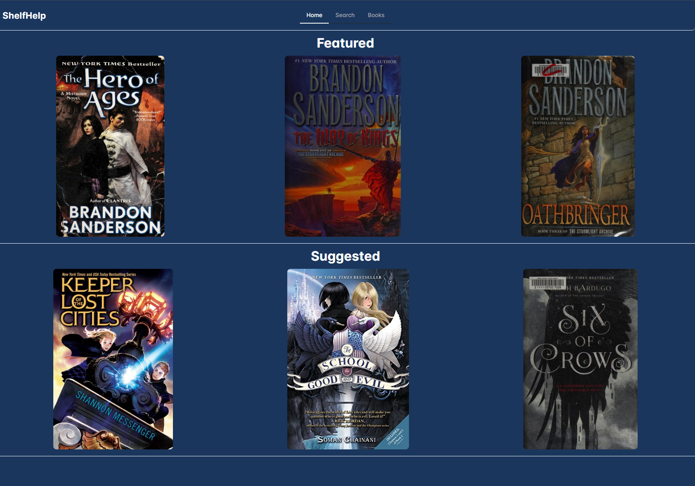

### Is a side project ever finsihed?

I’m working on a few side projects right now, but the one I’ve put the most time into is ShelfHelp. I built it mostly to get better at React and because I really enjoy reading. The core features are there, but there’s still a lot I want to add.
The next big step is setting up a database so users can come back and still see their saved books. That means I’ll also need to add authentication, so everyone gets access to the right set of books. After that, I want to improve the featured and suggested books on the homepage to be more accurate and varied based on users. One last big thing on the roadmap is a notes section for each book, so people can write down thoughts while they read.
You can check it out [here](https://shelfhelper.netlify.app/), or see the code on my GitHub [here](https://github.com/MunseeLogan-FS/ShelfHelp). Even though the original goal is done, the project doesn’t feel finished so I’m definitely excited to keep working on it.
