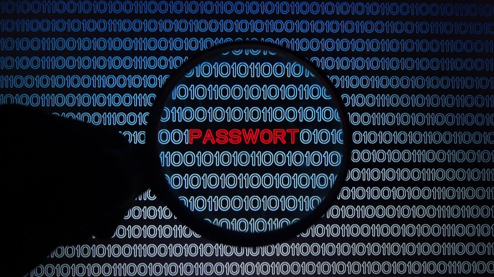

### Password Hashing

Hashing is important for storing passwords safley. Instead of saving the actual password, a hashed version that can’t be reversed back into plain text is saved. If someone breaks into the database, all they’ll see are a bunch of hashes, not real passwords. The only way to figure out what a hash represents is to guess the original password and see if it makes the same hash which takes a lot of time and effort. This is how sign-ins work too. When a user logs in, the password they enter gets hashed, and that hash is compared to the one in the database. If it matches, they're good to go. It’s a smart and secure way to protect user data.
